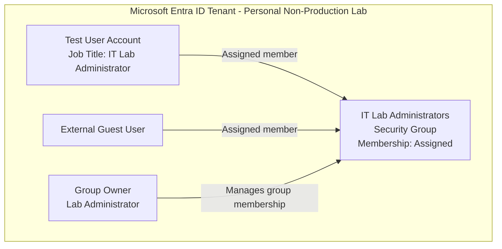

# Lab 01: Microsoft Entra ID Identity and Group Management

```mermaid
flowchart TB

    subgraph Tenant["Microsoft Entra ID Tenant - Personal Non-Production Lab"]
        User["Test User Account<br/>Job Title: IT Lab Administrator"]
        Guest["External Guest User"]
        Owner["Group Owner<br/>Lab Administrator"]
        Group["IT Lab Administrators<br/>Security Group<br/>Membership: Assigned"]

        User -->|"Assigned member"| Group
        Guest -->|"Assigned member"| Group
        Owner -->|"Manages group membership"| Group
    end
```
