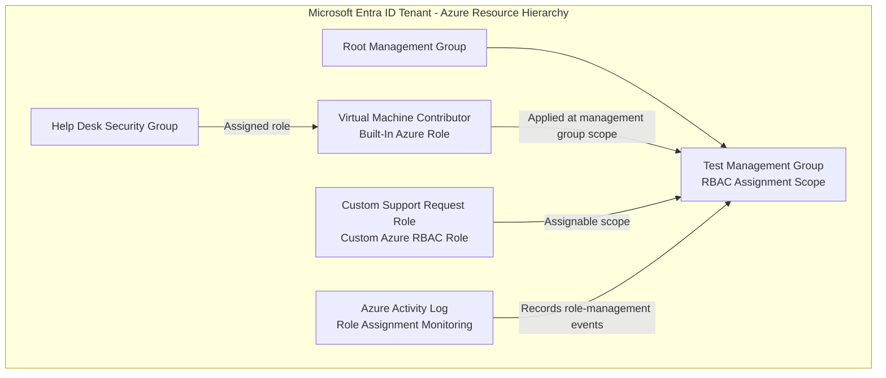

# Lab 02a: Azure Management Groups and Role-Based Access Control

```mermaid
flowchart TB

    subgraph Tenant["Microsoft Entra ID Tenant - Azure Resource Hierarchy"]
        Root["Root Management Group"]
        MG["Test Management Group<br/>RBAC Assignment Scope"]
        HelpDesk["Help Desk Security Group"]
        VMRole["Virtual Machine Contributor<br/>Built-In Azure Role"]
        CustomRole["Custom Support Request Role<br/>Custom Azure RBAC Role"]
        ActivityLog["Azure Activity Log<br/>Role Assignment Monitoring"]

        Root --> MG
        HelpDesk -->|"Assigned role"| VMRole
        VMRole -->|"Applied at management group scope"| MG
        CustomRole -->|"Assignable scope"| MG
        ActivityLog -->|"Records role-management events"| MG
    end
```
