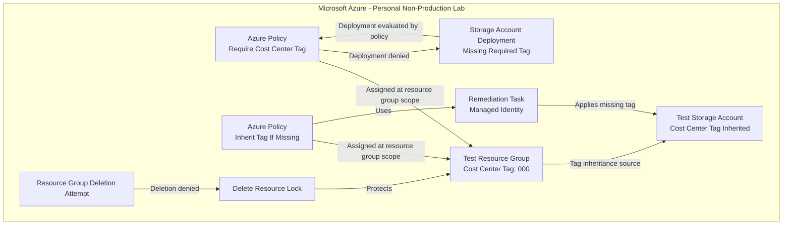

# Lab 02b: Manage Governance with Azure Policy

```mermaid
flowchart TB

    subgraph Azure["Microsoft Azure - Personal Non-Production Lab"]
        RG["Test Resource Group<br/>Cost Center Tag: 000"]
        RequirePolicy["Azure Policy<br/>Require Cost Center Tag"]
        MissingTag["Storage Account Deployment<br/>Missing Required Tag"]
        InheritPolicy["Azure Policy<br/>Inherit Tag If Missing"]
        Remediation["Remediation Task<br/>Managed Identity"]
        Storage["Test Storage Account<br/>Cost Center Tag Inherited"]
        Lock["Delete Resource Lock"]
        DeleteAttempt["Resource Group Deletion Attempt"]

        RequirePolicy -->|"Assigned at resource group scope"| RG
        MissingTag -->|"Deployment evaluated by policy"| RequirePolicy
        RequirePolicy -->|"Deployment denied"| MissingTag

        InheritPolicy -->|"Assigned at resource group scope"| RG
        InheritPolicy -->|"Uses"| Remediation
        RG -->|"Tag inheritance source"| Storage
        Remediation -->|"Applies missing tag"| Storage

        Lock -->|"Protects"| RG
        DeleteAttempt -->|"Deletion denied"| Lock
    end
```
