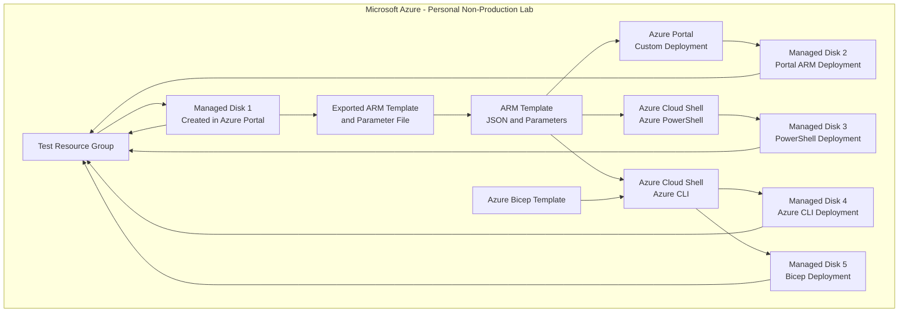

# Lab 03: ARM Templates and Bicep Deployment Architecture

```mermaid
flowchart TB

    subgraph Azure["Microsoft Azure - Personal Non-Production Lab"]
        RG["Test Resource Group"]
        Disk1["Managed Disk 1<br/>Created in Azure Portal"]
        Export["Exported ARM Template<br/>and Parameter File"]
        Template["ARM Template<br/>JSON and Parameters"]
        PortalDeploy["Azure Portal<br/>Custom Deployment"]
        PowerShell["Azure Cloud Shell<br/>Azure PowerShell"]
        CLI["Azure Cloud Shell<br/>Azure CLI"]
        Bicep["Azure Bicep Template"]
        Disk2["Managed Disk 2<br/>Portal ARM Deployment"]
        Disk3["Managed Disk 3<br/>PowerShell Deployment"]
        Disk4["Managed Disk 4<br/>Azure CLI Deployment"]
        Disk5["Managed Disk 5<br/>Bicep Deployment"]

        RG --> Disk1
        Disk1 --> Export
        Export --> Template

        Template --> PortalDeploy
        PortalDeploy --> Disk2

        Template --> PowerShell
        PowerShell --> Disk3

        Template --> CLI
        CLI --> Disk4

        Bicep --> CLI
        CLI --> Disk5

        Disk1 --> RG
        Disk2 --> RG
        Disk3 --> RG
        Disk4 --> RG
        Disk5 --> RG
    end
```
