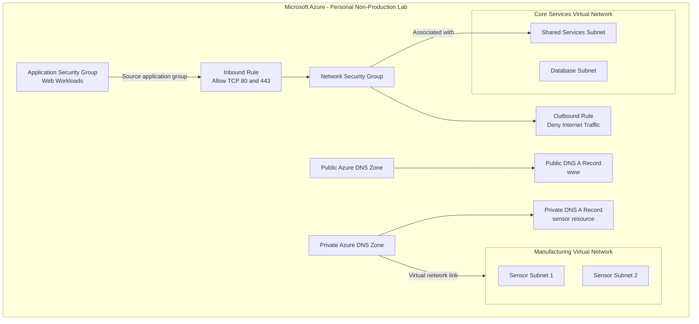

# Lab 04: Azure Virtual Networking Architecture

```mermaid
flowchart TB

    subgraph Azure["Microsoft Azure - Personal Non-Production Lab"]
        subgraph Core["Core Services Virtual Network"]
            Shared["Shared Services Subnet"]
            Database["Database Subnet"]
        end

        subgraph Manufacturing["Manufacturing Virtual Network"]
            Sensor1["Sensor Subnet 1"]
            Sensor2["Sensor Subnet 2"]
        end

        ASG["Application Security Group<br/>Web Workloads"]
        NSG["Network Security Group"]
        Inbound["Inbound Rule<br/>Allow TCP 80 and 443"]
        Outbound["Outbound Rule<br/>Deny Internet Traffic"]

        PublicDNS["Public Azure DNS Zone"]
        PublicRecord["Public DNS A Record<br/>www"]
        PrivateDNS["Private Azure DNS Zone"]
        PrivateRecord["Private DNS A Record<br/>sensor resource"]

        ASG -->|"Source application group"| Inbound
        Inbound --> NSG
        NSG -->|"Associated with"| Shared
        NSG --> Outbound

        PublicDNS --> PublicRecord
        PrivateDNS --> PrivateRecord
        PrivateDNS -->|"Virtual network link"| Manufacturing
    end
```
