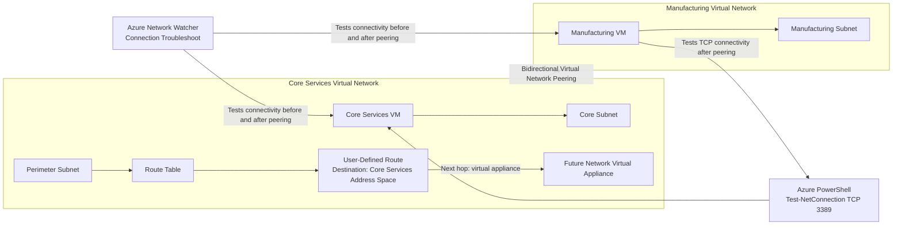

# Lab 05: Azure Intersite Connectivity Architecture

```mermaid
flowchart LR

    subgraph CoreVNet["Core Services Virtual Network"]
        CoreVM["Core Services VM"]
        CoreSubnet["Core Subnet"]
        Perimeter["Perimeter Subnet"]
        RouteTable["Route Table"]
        UDR["User-Defined Route<br/>Destination: Core Services Address Space"]
        NVA["Future Network Virtual Appliance"]

        CoreVM --> CoreSubnet
        Perimeter --> RouteTable
        RouteTable --> UDR
        UDR -->|"Next hop: virtual appliance"| NVA
    end

    subgraph ManufacturingVNet["Manufacturing Virtual Network"]
        ManufacturingVM["Manufacturing VM"]
        ManufacturingSubnet["Manufacturing Subnet"]

        ManufacturingVM --> ManufacturingSubnet
    end

    CoreVNet <-->|"Bidirectional Virtual Network Peering"| ManufacturingVNet

    NetworkWatcher["Azure Network Watcher<br/>Connection Troubleshoot"]
    PowerShell["Azure PowerShell<br/>Test-NetConnection TCP 3389"]

    NetworkWatcher -->|"Tests connectivity before and after peering"| CoreVM
    NetworkWatcher -->|"Tests connectivity before and after peering"| ManufacturingVM
    ManufacturingVM -->|"Tests TCP connectivity after peering"| PowerShell
    PowerShell --> CoreVM
```
